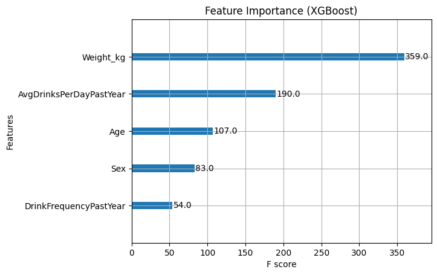
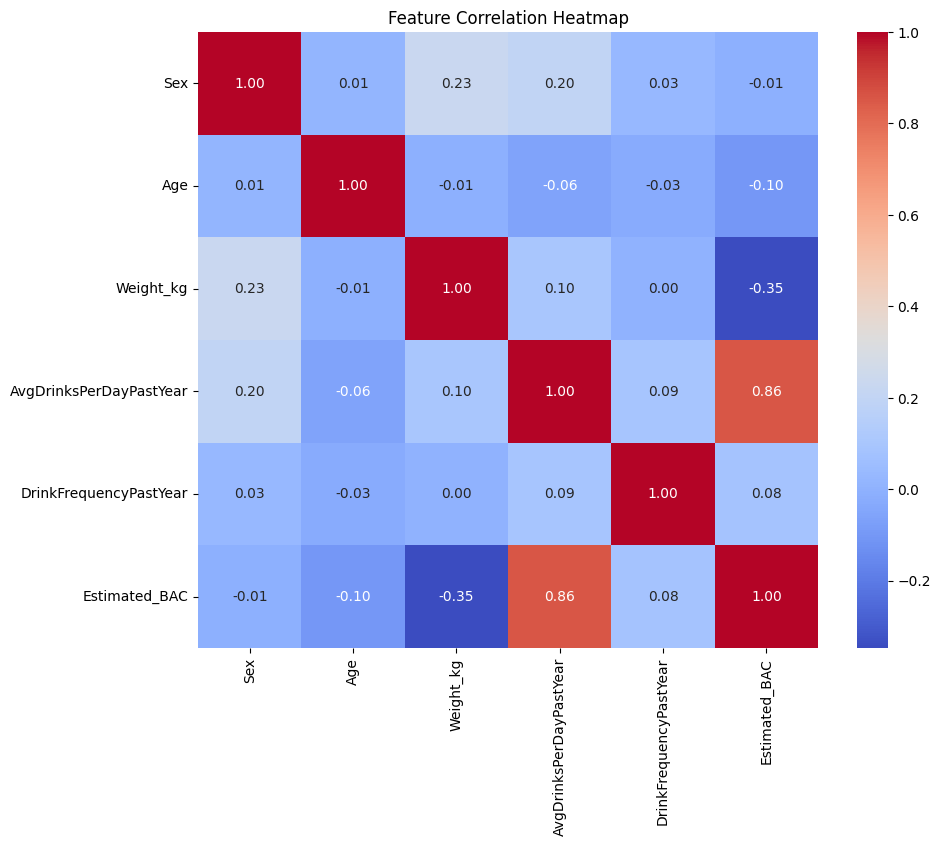
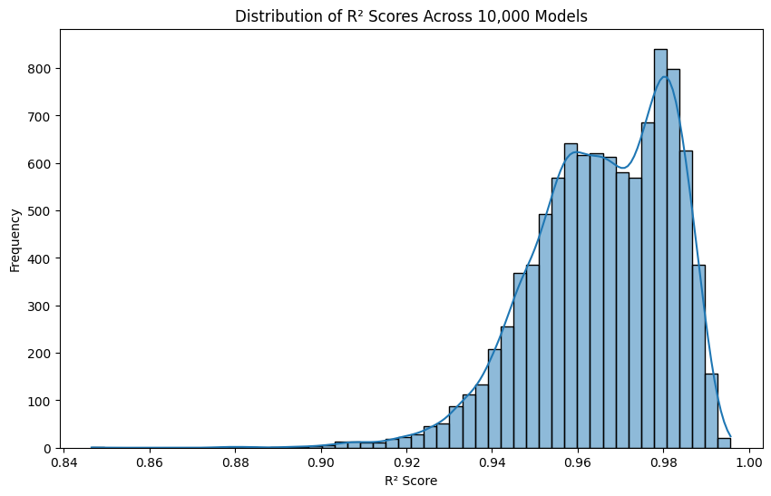

# Widmark Formula BAC Estimator

**Using Machine Learning and Real-World NHANES Data**

---

## Overview
This project builds a predictive model to estimate Blood Alcohol Content (BAC) using the **Widmark Formula**. 
It combines user demographic information and drinking behavior to predict BAC levels and classify intoxication stages.

Using real-world survey data (NHANES 2015-2016), I apply machine learning (XGBoost) to refine BAC estimations based on features like:
- Sex
- Age
- Weight
- Average number of drinks per day
- Drinking frequency

---

## How It Works

1. **Data Preparation**:
   - Load cleaned NHANES alcohol usage and body measurement datasets.
   - Preprocess features and handle missing values.

2. **Widmark Formula Application**:
   - BAC is estimated using the classic Widmark formula:

     $$ BAC = \frac{0.6 \times \text{drinks} \times 5.14}{\text{weight (lbs)} \times r} - 0.015 \times \text{hours} $$

     where \( r \) depends on sex (Male = 0.73, Female = 0.66).

3. **Model Training**:
   - An XGBoost Regressor is trained to predict BAC.
   - Evaluation metrics include R² score and Mean Squared Error (MSE).

4. **Model Stability Testing**:
   - 10,000 models are trained with random splits to simulate performance variability.

5. **User Interaction**:
   - Users can input their sex, age, weight, and number of drinks to receive a BAC prediction and intoxication classification.

---

## Intoxication Classification

| BAC Level | Status |
|:---|:---|
| < 0.02 | Sober |
| 0.02 – 0.05 | Tipsy |
| 0.05 – 0.08 | Buzzed |
| 0.08 – 0.10 | Legally Impaired |
| 0.10 – 0.15 | Drunk |
| 0.15 – 0.30 | Very Drunk |
| 0.30 – 0.40 | Severe Alcohol Poisoning |
| > 0.40 | Fatal Risk |

---

## Technologies Used
- Python 3.11+
- Pandas
- NumPy
- Matplotlib & Seaborn (Visualization)
- Scikit-Learn (train_test_split, metrics)
- XGBoost (Machine Learning)
- Jupyter Notebook (VS Code Extension)

---

## Why XGBoost?

XGBoost (Extreme Gradient Boosting) was chosen because:

- **High Performance**: Exceptional predictive accuracy for regression tasks.
- **Handles Missing Values**: Automatically accounts for missing survey data.
- **Feature Importance**: Provides built-in methods to rank feature relevance.
- **Speed and Efficiency**: "hist" tree method enables fast training on large datasets.
- **Regularization**: Helps reduce overfitting with L1/L2 penalties.

Overall, XGBoost balances **accuracy**, **efficiency**, and **interpretability**, making it ideal for this problem.

---

## How to Run Locally

1. Clone this repository:

```bash
git clone https://github.com/laniel123/Widmark-Formula-Model.git
cd Widmark-Formula-Model
```

2. Install required libraries:

```bash
pip install -r requirements.txt
```

3. Open `formula model.ipynb` in Jupyter Notebook / VS Code.
4. Run all cells sequentially.
5. (Optional) Try the user BAC prediction tool at the end!

---

## Feature Importance



The model heavily relies on reported drinking behavior (average drinks per day, frequency) and weight when estimating BAC.

---

## Feature Correlation Heatmap



Some features, like weight and drinking patterns, show positive correlations with BAC estimates, while others remain weakly correlated.

---

## R² Score Distribution (10,000 Models)



### R² Score Distribution Interpretation

To evaluate the stability and robustness of the Widmark BAC Estimator model, 10,000 different instances were trained, each with different random splits.

Most R² scores fall between 0.94 and 0.98, with a strong peak around 0.96–0.97. Very few models fell below 0.90. 

**This demonstrates that the model is highly stable, robust to data variations, and consistently provides strong predictive power across random splits.**

---

## Acknowledgments
- National Health and Nutrition Examination Survey (NHANES 2015-2016)
- Classic Widmark BAC Estimation Formula
- Python Data Science Ecosystem

---

> **Disclaimer**: This project is for educational purposes only and does not replace professional BAC testing or legal standards.
